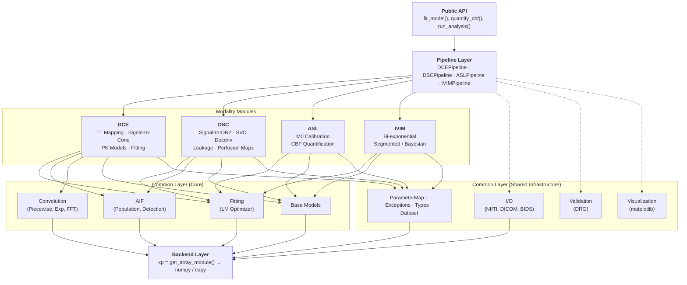
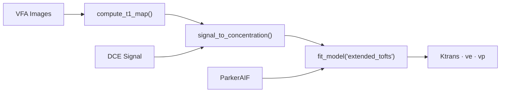
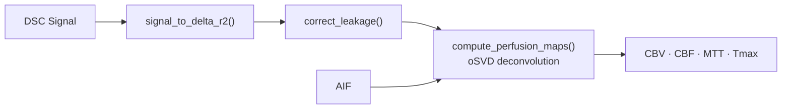
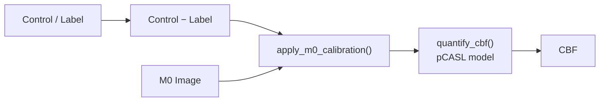
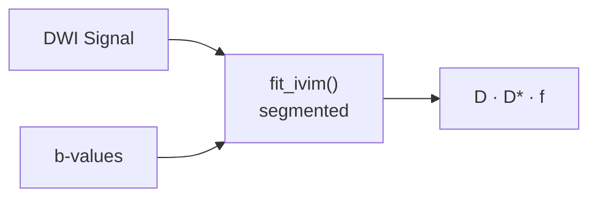

# Architecture Overview

High-level overview of osipy's architecture, design principles, and code organization.

## Design Philosophy

osipy is built on four core principles:

1. **GPU/CPU Agnostic**: All numerical code works on both
2. **OSIPI Compliant**: Standard parameter names and validation
3. **Modular Design**: Independent, composable components
4. **Extensible**: Supports adding new methods

## System Architecture



Not every modality depends on every common submodule. The diagram above shows the actual dependency edges:

- **All four modalities** use the shared Fitting engine (`LevenbergMarquardtFitter`) via the `FittableModel` protocol, plus Backend (array module), ParameterMap, Exceptions, and Types. Each modality wraps its signal model in a binding adapter (`BoundDCEModel`, `BoundIVIMModel`, `BoundASLModel`, `BoundDSCModel`, `BoundGammaVariateModel`) that fixes independent variables so the fitter only sees free parameters.
- **All four modalities** share the `BaseSignalModel` base class from common/models (`BasePerfusionModel` for DCE, `IVIMModel` for IVIM, `BaseASLModel` for ASL, `DSCConvolutionModel` for DSC).
- **DCE and DSC** use AIF utilities (population AIFs and automatic detection). DCE additionally uses Convolution functions (piecewise-linear, exponential, FFT).
- **I/O, Validation, and Visualization** are used at the pipeline level and by end users, not by the modality internals directly.

## Module Structure

### Overview

```text
osipy/
├── __init__.py           # Public API exports
├── _version.py           # Version management
│
├── common/               # Shared infrastructure
│   ├── backend/          # Array module abstraction (CPU/GPU)
│   ├── aif/              # Arterial input functions (DCE)
│   ├── convolution/      # AIF convolution methods (DCE)
│   ├── fitting/          # Model fitting algorithms (all modalities)
│   ├── io/               # File I/O (NIfTI, DICOM, BIDS)
│   ├── models/           # Base model classes + FittableModel protocol
│   ├── signal/           # Signal processing
│   ├── validation/       # DRO comparison
│   ├── visualization/    # Plotting utilities
│   ├── dataset.py        # PerfusionDataset container
│   ├── parameter_map.py  # ParameterMap container
│   ├── types.py          # Enums and type definitions
│   ├── exceptions.py     # Custom exception hierarchy
│   ├── caching.py        # Result caching utilities
│   └── logging.py        # Logging configuration
│
├── dce/                  # DCE-MRI analysis
│   ├── t1_mapping/       # T1 estimation methods
│   ├── concentration/    # Signal → concentration
│   └── models/           # PK models (Tofts, etc.)
│
├── dsc/                  # DSC-MRI analysis
│   ├── concentration/    # Signal → ΔR2*
│   ├── deconvolution/    # SVD methods + signal model + SVD fitters
│   ├── leakage/          # BSW + bidirectional leakage correction
│   ├── parameters/       # CBV, CBF, MTT
│   ├── arrival/          # Bolus arrival detection
│   └── normalization.py  # Signal normalization
│
├── asl/                  # ASL analysis
│   ├── labeling/         # Labeling schemes
│   ├── calibration/      # M0 calibration
│   └── quantification/   # CBF calculation
│
├── ivim/                 # IVIM analysis
│   ├── models/           # Bi-exponential model
│   └── fitting/          # Segmented/full fitting
│
├── pipeline/             # End-to-end workflows
│   ├── runner.py         # Unified entry point
│   └── *_pipeline.py     # Modality-specific pipelines
│
└── cli/                  # Command-line interface
    ├── main.py           # argparse CLI (osipy)
    ├── config.py         # Pydantic v2 config models
    ├── runner.py         # Pipeline orchestration from config
    └── wizard.py         # Interactive configuration wizard
```

### Backend Layer

The backend layer provides GPU/CPU abstraction:

!!! example "Backend layer implementation"

    ```python
    # osipy/common/backend/array_module.py

    def get_array_module(*arrays):
        """Return numpy or cupy based on input arrays."""
        for arr in arrays:
            if hasattr(arr, '__cuda_array_interface__'):
                import cupy
                return cupy
        return numpy
    ```

**Key exports**:

- `get_array_module()` - Returns appropriate array library
- `to_numpy()` - Convert to numpy (for I/O)
- `to_gpu()` - Convert to cupy (for acceleration)
- `is_gpu_available()` - Check GPU support

### Common Layer

Shared infrastructure with varying usage across modalities. Backend, ParameterMap, Exceptions, Base Models, and Fitting are used by all four modalities. AIF is used by DCE and DSC. Convolution is specific to DCE:

#### I/O (`common/io/`)

Used at the pipeline level and by end users for data loading and export. The modality modules themselves do not import I/O directly — they operate on in-memory arrays.

!!! example "I/O function signatures"

    ```python
    # NIfTI loading
    def load_nifti(path, time_points=None):
        """Load NIfTI file into PerfusionDataset."""

    # DICOM loading
    def load_dicom(path, series_uid=None):
        """Load DICOM series into PerfusionDataset."""

    # BIDS export
    def export_bids(output_dir, subject, parameters, ...):
        """Export results in BIDS derivatives format."""
    ```

#### Fitting (`common/fitting/`)

The shared `LevenbergMarquardtFitter` is a generic, GPU-accelerated non-linear optimizer used by all four modalities. It works with any model implementing the `FittableModel` protocol (`predict_array_batch()`, `get_bounds()`, `parameters`). Each modality wraps its signal model in a binding adapter that fixes independent variables (time+AIF for DCE, b-values for IVIM, PLDs for ASL, time for DSC gamma-variate), so the fitter only sees free parameters.

!!! example "Levenberg-Marquardt fitter interface"

    ```python
    # Levenberg-Marquardt optimizer (registered as "lm")
    class LevenbergMarquardtFitter(BaseFitter):
        """GPU-accelerated optimizer for per-voxel fitting."""

        def fit_batch(self, model, observed_batch, ...):
            """Fit model to a batch of voxels."""

        def fit_image(self, model, data_4d, mask=None, ...):
            """Fit model to all voxels (handles chunking, GPU)."""
    ```

The `FittableModel` protocol and `BaseBoundModel` base class (`common/models/fittable.py`) handle the binding pattern. `BaseBoundModel` provides shared fixed-parameter logic — any parameter can be pinned to a constant value, removing it from the optimization.

Binding adapters per modality:

| Adapter | Module | Fixes |
|---------|--------|-------|
| `BoundDCEModel` | `dce/models/binding.py` | time, AIF |
| `BoundIVIMModel` | `ivim/models/binding.py` | b-values (+ analytical Jacobian) |
| `BoundASLModel` | `asl/quantification/binding.py` | PLDs, labeling params |
| `BoundGammaVariateModel` | `dsc/concentration/gamma_model.py` | time |
| `BoundDSCModel` | `dsc/deconvolution/signal_model.py` | AIF, time (pre-computes SVD) |

#### AIF (`common/aif/`)

Used by DCE for arterial input function selection and detection. Not used by DSC, ASL, or IVIM.

!!! example "Population AIF classes and automatic detection"

    ```python
    # Population AIFs (all extend BaseAIF)
    class ParkerAIF(BaseAIF): ...
    class GeorgiouAIF(BaseAIF): ...
    class FritzHansenAIF(BaseAIF): ...
    class WeinmannAIF(BaseAIF): ...
    class McGrathAIF(BaseAIF): ...  # Preclinical

    # Automatic detection
    def detect_aif(dataset, params=None, roi_mask=None, method=None):
        """Automatically detect AIF from data."""

    # Arterial delay
    def shift_aif(aif, time, delay):
        """Shift AIF by a delay (seconds) for delay fitting."""
    ```

#### Convolution (`common/convolution/`)

Used by DCE pharmacokinetic models for convolving the AIF with tissue response functions. Not used by DSC, ASL, or IVIM.

!!! example "Convolution functions"

    ```python
    # Piecewise-linear convolution (registered as "piecewise_linear")
    def convolve_aif(aif, time, kernel_func):
        """Convolve AIF with a model kernel."""

    # Recursive exponential convolution (registered as "exponential")
    def expconv(time_constant, time, input_function):
        """Fast exponential convolution for compartment models."""

    # FFT-based convolution (registered as "fft")
    def fft_convolve(signal_a, signal_b, dt):
        """Frequency-domain convolution."""
    ```

### Modality Modules

All four modalities use the shared `LevenbergMarquardtFitter` via binding adapters, plus the Backend abstraction, ParameterMap output, and exception types. DCE and DSC additionally use AIF from common. DCE additionally uses Convolution from common.

#### DCE Module

The most coupled modality — uses shared Fitting (LM optimizer), AIF (population models and detection), and Convolution (piecewise-linear, exponential, FFT) from common.

!!! example "DCE module key functions and classes"

    ```python
    # osipy/dce/

    # T1 mapping
    def compute_t1_map(dataset, method="vfa"):
        """Compute T1 map from VFA or Look-Locker data."""

    # Signal conversion
    def signal_to_concentration(signal, t1_map, acquisition_params, t1_blood=1440.0, method="spgr"):
        """Convert DCE signal to Gd concentration."""

    # Models
    class ToftsModel(BasePerfusionModel):
        """Standard Tofts pharmacokinetic model."""

    class ExtendedToftsModel(BasePerfusionModel):
        """Extended Tofts with plasma term."""

    # Fitting
    def fit_model(model_name, concentration, aif, time):
        """Fit a pharmacokinetic model to concentration data."""
    ```

#### DSC Module

DSC deconvolution is implemented via two paths:

1. **Signal model path** (preferred): `DSCConvolutionModel(BaseSignalModel)` defines the forward model C(t) = CBF * AIF ⊛ R(t). `BoundDSCModel(BaseBoundModel)` fixes AIF and time, pre-computes SVD components. SVD fitter classes (`SSVDFitter`, `CSVDFitter`, `OSVDFitter`, `TikhonovFitter`) inherit from `BaseFitter` and use the shared fitting infrastructure.
2. **Legacy deconvolver path**: `BaseDeconvolver` ABC with `SSVDDeconvolver`, `CSVDDeconvolver`, `OSVDDeconvolver` accessed via `get_deconvolver()`. Retained for backward compatibility.

Gamma-variate fitting for recirculation removal uses the shared `LevenbergMarquardtFitter` via `BoundGammaVariateModel`. Leakage correction provides BSW and bidirectional correctors. Bolus arrival detection is also registry-driven.

!!! example "DSC module key functions"

    ```python
    # osipy/dsc/

    # Signal conversion
    def signal_to_delta_r2(signal, te, baseline_end):
        """Convert DSC signal to ΔR2*."""

    # Deconvolution (legacy path)
    def get_deconvolver(method):
        """Get a deconvolver by name (e.g., 'oSVD', 'cSVD')."""

    # Deconvolution (signal model path)
    class DSCConvolutionModel(BaseSignalModel):
        """Forward model C(t) = CBF * AIF ⊛ R(t)."""

    # Leakage correction
    def correct_leakage(signal, delta_r2, method='bsw'):
        """BSW or bidirectional leakage correction."""

    # Parameters
    def compute_perfusion_maps(concentration, aif, time):
        """Calculate CBV, CBF, MTT, TTP, Tmax."""
    ```

### Pipeline Layer

End-to-end workflows that orchestrate the modality modules:

!!! example "Unified pipeline runner entry point"

    ```python
    # osipy/pipeline/runner.py

    def run_analysis(data, modality, **kwargs):
        """Unified analysis entry point.

        Automatically selects appropriate pipeline
        based on modality.
        """
        pipelines = {
            'dce': DCEPipeline,
            'dsc': DSCPipeline,
            'asl': ASLPipeline,
            'ivim': IVIMPipeline,
        }
        pipeline = pipelines[modality](**kwargs)
        return pipeline.run()
    ```

## Data Flow

Default pipeline paths. Each modality supports additional options (AIF sources, fitting methods, etc.) — see the how-to guides for alternatives.

### DCE-MRI



### DSC-MRI



### ASL



### IVIM



### Key Data Structures

!!! example "Core data container dataclasses"

    ```python
    # PerfusionDataset: Input data container
    @dataclass
    class PerfusionDataset:
        data: NDArray           # 3D or 4D image data
        affine: NDArray         # Spatial transformation
        time_points: NDArray    # Time array (for 4D)
        modality: Modality      # DCE, DSC, ASL, IVIM
        acquisition_params: AcquisitionParams  # Typed dataclass (e.g., DCEAcquisitionParams)

    # ParameterMap: Output parameter container
    @dataclass
    class ParameterMap:
        values: NDArray         # 3D parameter values
        name: str               # CAPLEX name (e.g., "Ktrans")
        units: str              # Standard units
        quality_mask: NDArray   # Valid voxel mask
        provenance: dict        # Analysis metadata
    ```

## Class Hierarchy

All registered components inherit from `BaseComponent(ABC)`, which provides `name` and `reference` properties. The full hierarchy:

```text
BaseComponent (osipy.common.models.base) — name + reference
├── BaseSignalModel — + parameters, parameter_units, get_bounds()
│   ├── BasePerfusionModel[P] (dce/models/base) — DCE pharmacokinetic models
│   │   ├── ToftsModel, ExtendedToftsModel, PatlakModel
│   │   ├── TwoCompartmentModel (2CXM)
│   │   └── TwoCompartmentUptakeModel (2CUM)
│   ├── IVIMModel (ivim/models/biexponential) — IVIM signal models
│   │   ├── IVIMBiexponentialModel
│   │   └── IVIMSimplifiedModel
│   ├── BaseASLModel (asl/quantification/base) — ASL signal models
│   │   ├── PCASLSinglePLDModel, PASLSinglePLDModel, CASLSinglePLDModel
│   │   └── BuxtonMultiPLDModel
│   └── DSCConvolutionModel (dsc/deconvolution/signal_model) — DSC forward model
├── BaseFitter (common/fitting/base) — + fit_batch(), fit_image()
│   ├── LevenbergMarquardtFitter — iterative parametric (all modalities)
│   ├── BayesianFitter — MAP estimation
│   ├── SSVDFitter — standard SVD truncation
│   ├── CSVDFitter — circular SVD truncation
│   ├── OSVDFitter — oscillation-index SVD
│   └── TikhonovFitter — Tikhonov regularization
├── BaseLeakageCorrector — DSC leakage correction
│   ├── BSWCorrector — Boxerman-Schmainda-Weisskoff
│   └── BidirectionalCorrector
├── BaseM0Calibration — ASL M0 calibration
│   ├── SingleM0Calibration, VoxelwiseM0Calibration, ReferenceRegionM0Calibration
├── BaseArrivalDetector — DSC bolus arrival detection
│   └── ResiduePeakDetector
├── BaseAIFDetector — AIF detection from image data
│   └── MultiCriteriaAIFDetector
├── BaseAIF — population AIF models
│   ├── ParkerAIF, GeorgiouAIF, FritzHansenAIF, WeinmannAIF, McGrathAIF
└── BaseDeconvolver — DSC deconvolution (legacy interface)
    ├── StandardSVDDeconvolver, CircularSVDDeconvolver, OscillationSVDDeconvolver

FittableModel protocol (common/models/fittable)
└── BaseBoundModel — shared fixed-param logic
    ├── BoundDCEModel — fixes time + AIF
    ├── BoundSPGRModel — fixes flip angles + TR (VFA T1 mapping)
    ├── BoundLookLockerModel — fixes inversion times (Look-Locker T1 mapping)
    ├── BoundIVIMModel — fixes b-values, analytical Jacobian
    ├── BoundASLModel — fixes PLDs + labeling params
    ├── BoundDSCModel — fixes AIF + time, pre-computes SVD
    └── BoundGammaVariateModel — fixes time
```

## Extension Points

All extension points use the registry pattern — one file, one decorator. 17+ registries span all modalities:

| Extension | Decorator | Lookup | List |
|-----------|-----------|--------|------|
| DCE PK model | `@register_model("name")` | `get_model("name")` | `list_models()` |
| IVIM signal model | `@register_ivim_model("name")` | `get_ivim_model("name")` | `list_ivim_models()` |
| DSC deconvolver | `@register_deconvolver("name")` | `get_deconvolver("name")` | `list_deconvolvers()` |
| DSC leakage corrector | `@register_leakage_corrector("name")` | `get_leakage_corrector("name")` | `list_leakage_correctors()` |
| DSC normalizer | `@register_normalizer("name")` | `get_normalizer("name")` | `list_normalizers()` |
| DSC arrival detector | `@register_arrival_detector("name")` | `get_arrival_detector("name")` | `list_arrival_detectors()` |
| ASL quantification model | `@register_quantification_model("name")` | `get_quantification_model("name")` | `list_quantification_models()` |
| ASL ATT model | `@register_att_model("name")` | `get_att_model("name")` | `list_att_models()` |
| ASL difference method | `@register_difference_method("name")` | `get_difference_method("name")` | `list_difference_methods()` |
| M0 calibration method | `@register_m0_calibration("name")` | `get_m0_calibration("name")` | `list_m0_calibrations()` |
| Population AIF | `@register_aif("name")` | `get_population_aif("name")` | `list_aifs()` |
| AIF detector | `@register_aif_detector("name")` | `get_aif_detector("name")` | `list_aif_detectors()` |
| Fitter | `@register_fitter("name")` | `get_fitter("name")` | `list_fitters()` |
| T1 mapping method | `@register_t1_method("name")` | `get_t1_method("name")` | `list_t1_methods()` |
| Concentration model | `@register_concentration_model("name")` | `get_concentration_model("name")` | `list_concentration_models()` |
| IVIM fitting strategy | `@register_ivim_fitter("name")` | `get_ivim_fitter("name")` | `list_ivim_fitters()` |
| Convolution method | `@register_convolution("name")` | `get_convolution("name")` | `list_convolutions()` |

All registries use `DataValidationError` for unknown names and `logging.getLogger(__name__)` with warnings for overwrites.

### Adding a New Model

1. Create class inheriting from `BasePerfusionModel`
2. Implement `_predict()` using xp pattern
3. Decorate with `@register_model("name")`

See [How to Add a New Model](../how-to/add-pharmacokinetic-model.md).

### Adding a New AIF

1. Create class inheriting from `BaseAIF`
2. Decorate with `@register_aif("name")`

### Adding a New Pipeline

1. Create `NewPipeline` class
2. Implement required steps
3. Add dispatch in `runner.py`

## Testing Architecture

```text
tests/
├── unit/              # Unit tests (isolated)
│   ├── common/        # Common module tests
│   ├── dce/           # DCE module tests
│   ├── dsc/           # DSC module tests
│   ├── asl/           # ASL module tests
│   └── ivim/          # IVIM module tests
│
├── integration/       # End-to-end tests
│   └── test_pipeline.py
│
└── conftest.py        # Shared fixtures (synthetic DROs)
```

### Fixture Strategy

!!! example "Test fixtures for synthetic data and dual backends"

    ```python
    # conftest.py

    @pytest.fixture
    def dce_dro():
        """Synthetic DCE-MRI data with known ground truth."""
        return generate_dce_synthetic(
            shape=(32, 32, 8, 50),
            ktrans_true=0.1,
            ve_true=0.2,
            vp_true=0.02
        )

    @pytest.fixture(params=['numpy', 'cupy'])
    def xp(request):
        """Parametrize tests for both backends."""
        if request.param == 'cupy':
            pytest.importorskip('cupy')
        return request.param
    ```

## Performance Considerations

### Memory Management

!!! example "Chunked processing for large datasets"

    ```python
    # Large dataset handling
    def fit_large_dataset(data, chunk_size=10000):
        """Process in memory-efficient chunks."""
        n_voxels = data.reshape(-1, data.shape[-1]).shape[0]

        for start in range(0, n_voxels, chunk_size):
            chunk = data_chunk(start, chunk_size)
            result_chunk = fit(chunk)
            store_result(result_chunk, start)
    ```

### GPU Memory

!!! example "Monitor and free GPU memory"

    ```python
    # Monitor GPU memory
    import cupy as cp

    mempool = cp.get_default_memory_pool()
    print(f"Used: {mempool.used_bytes() / 1e9:.2f} GB")

    # Free memory when needed
    mempool.free_all_blocks()
    ```

## Dependencies

### Core Dependencies

| Package | Purpose | Required |
|---------|---------|----------|
| numpy | Array operations | Yes |
| nibabel | NIfTI I/O | Yes |
| pydicom | DICOM I/O | Yes |
| pybids | BIDS support | Yes |
| matplotlib | Visualization | Yes |

### Optional Dependencies

| Package | Purpose | Required |
|---------|---------|----------|
| cupy | GPU acceleration | No |

### Development Dependencies

| Package | Purpose |
|---------|---------|
| pytest | Testing |
| ruff | Linting |
| mypy | Type checking |
| mkdocs | Documentation |

## See Also

- [The xp Abstraction Pattern](xp-abstraction.md)
- [OSIPI Standards](osipi-standards.md)
- [Contributing Guide](../contributing.md)
