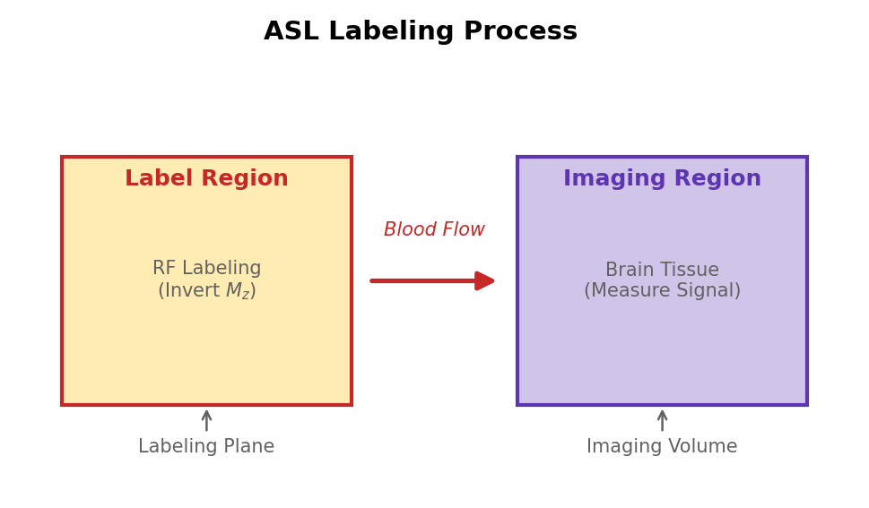
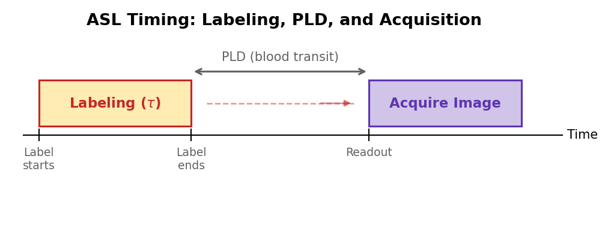

# Understanding ASL Physics

Arterial Spin Labeling (ASL) is a non-contrast MRI technique for measuring cerebral blood flow. This page covers the underlying physics.

## The Core Idea

ASL uses the body's own blood water as an endogenous tracer. By magnetically "labeling" arterial blood before it enters the brain, we create a measurable perfusion signal without injecting any contrast agent.

## The Labeling Process

### Magnetic Labeling

Blood water has a magnetic moment (like a tiny compass). ASL manipulates this:

1. **Equilibrium**: Blood protons align with the magnetic field (M₀)
2. **Labeling**: RF pulses flip the magnetization (inversion or saturation)
3. **Flow**: Labeled blood flows into the imaging region
4. **Readout**: Measure the difference between labeled and unlabeled images

### Label vs Control

We acquire two types of images:

- **Control**: No labeling (or symmetric "sham" labeling)
- **Label**: Blood is inverted/saturated

The **difference signal** (ΔM = Control - Label) is proportional to perfusion.

## Labeling Schemes

### PASL (Pulsed ASL)

Labels a "slab" of blood with a single RF pulse:

- **Advantages**: High labeling efficiency (~95-98%)
- **Disadvantages**: Sensitive to transit time, variable labeled volume
- **Key parameter**: TI₁ (inversion time)

### CASL (Continuous ASL)

Continuously labels blood at a specific plane:

- **Advantages**: Larger labeled volume
- **Disadvantages**: SAR concerns, magnetization transfer effects
- **Key parameters**: τ (labeling duration), PLD

### pCASL (Pseudo-Continuous ASL)

Combines benefits of PASL and CASL using train of RF pulses:

- **Advantages**: High labeling efficiency (~80-90%), lower SAR
- **Most widely used** in clinical and research settings
- **Key parameters**: τ (labeling duration), PLD (post-labeling delay)

## The General Kinetic Model

### Single-PLD Equation

For pCASL, CBF is calculated as:

$$
CBF = \frac{6000 \cdot \lambda \cdot \Delta M \cdot e^{PLD/T_{1b}}}{2 \cdot \alpha \cdot T_{1b} \cdot M_0 \cdot (1 - e^{-\tau/T_{1b}})}
$$

Where:

| Symbol | Description | Typical Value |
|--------|-------------|---------------|
| CBF | Cerebral blood flow | mL/100g/min |
| λ | Blood-brain partition coefficient | 0.9 ml/g |
| ΔM | Perfusion-weighted signal | a.u. |
| PLD | Post-labeling delay | 1.5-2.0 s |
| T₁b | T1 of blood | 1.65 s (3T) |
| α | Labeling efficiency | 0.85 (pCASL) |
| τ | Labeling duration | 1.8 s |
| M₀ | Equilibrium magnetization | from calibration |

### Multi-PLD Model

With multiple PLDs, we can also estimate arterial transit time (ATT):

$$
\Delta M(PLD) = \begin{cases}
0 & \text{if } PLD < ATT \\
2 \cdot M_0 \cdot CBF \cdot \alpha \cdot T_{1b} \cdot e^{-ATT/T_{1b}} \cdot (1-e^{-(PLD-ATT)/T_{1b}}) & \text{if } ATT < PLD < ATT+\tau \\
\text{(full equation)} & \text{if } PLD > ATT+\tau
\end{cases}
$$

This allows fitting both CBF and ATT from the PLD curve.

## Key Parameters

### Post-Labeling Delay (PLD)

The time between labeling and image acquisition:

- **Too short**: Labeled blood hasn't arrived → underestimate CBF
- **Too long**: Label has decayed → low SNR
- **Optimal**: Matches arterial transit time (~1.5-2.0 s for brain)

### Labeling Duration (τ)

How long blood is labeled:

- **Longer τ**: More labeled blood → higher signal
- **Trade-off**: Magnetization transfer effects increase
- **Typical**: 1.8 s for pCASL

### Labeling Efficiency (α)

Fraction of blood that is actually inverted:

| Method | Efficiency |
|--------|------------|
| PASL | 0.95-0.98 |
| CASL | 0.68-0.73 |
| pCASL | 0.80-0.90 |

Measured using: α = 1 - (M_label / M_control)

## M₀ Calibration

### Why M₀ is Needed

The perfusion signal ΔM must be normalized by M₀ for absolute quantification:

$$
CBF \propto \frac{\Delta M}{M_0}
$$

### M₀ Acquisition

Acquire a separate M₀ image with:

- **Long TR** (> 5 s) for full relaxation
- **No labeling**
- Same coil and geometry as ASL

### M₀ Corrections

M₀ may need corrections for:

1. **T1 recovery**: If TR < 5×T1
2. **Coil sensitivity**: Spatial B1 variations
3. **T2* decay**: If TE is significant

## Signal Model

### Full Signal Equation

The measured ASL signal is:

$$
\Delta M = M_0 \cdot CBF \cdot \alpha \cdot T_{1b} \cdot e^{-\delta/T_{1b}} \cdot q(t)
$$

Where q(t) is the delivery function depending on PLD and τ.

### Signal-to-Noise Considerations

ASL has inherently low SNR because:

- ΔM is typically 0.5-1.5% of M₀
- Need multiple averages (20-60 pairs typical)

Ways to improve SNR:

- Background suppression
- 3D readout (whole-brain)
- Multiple averages
- Higher field strength (3T > 1.5T)

## Physical Assumptions

### Single-Compartment Model

Standard ASL assumes:

1. **Well-mixed single compartment**: Instantaneous exchange between blood and tissue
2. **No venous outflow**: All labeled blood remains in imaging volume
3. **Uniform ATT**: All blood arrives at same time

These may be violated in:

- Pathology (stroke, tumors)
- White matter (longer ATT)
- Large vessels

### Blood-Brain Barrier

ASL measures flow of **water**, not contrast agent:

- Water freely crosses BBB
- No permeability limitation
- But: exchange time affects signal

## Practical Considerations

### Background Suppression

Reduces static tissue signal for better ΔM detection:

Because T1(tissue) < T1(blood), carefully timed inversion pulses can null the static tissue signal while preserving the labeled blood signal, improving the quality of the control-label subtraction.

### Motion Sensitivity

ASL is sensitive to motion because:

- Small signal (ΔM ≈ 1% of M₀)
- Subtraction amplifies motion artifacts

Solutions:

- Background suppression
- 3D acquisition
- Motion correction algorithms

### Partial Volume Effects

At voxel boundaries:

- Gray matter: CBF ≈ 60 mL/100g/min
- White matter: CBF ≈ 25 mL/100g/min
- CSF: CBF = 0

Partial volume correction may be needed for accurate quantification.

## CBF Values

### Expected Ranges

| Tissue | CBF (mL/100g/min) |
|--------|-------------------|
| Gray matter | 50-80 |
| White matter | 20-30 |
| Whole brain average | 40-60 |
| Stroke (acute) | ≈ 0 |
| Tumor (enhancing) | 50-150+ |

### Interpretation

- **Low CBF**: Ischemia, infarct, hypoperfusion
- **High CBF**: Hyperperfusion, luxury perfusion, tumor
- **Asymmetry**: Compare hemispheres

## Advantages of ASL

1. **Non-invasive**: No contrast injection
2. **Repeatable**: Can acquire multiple times
3. **Quantitative**: Absolute CBF in mL/100g/min
4. **Safe**: No nephrotoxicity concerns
5. **Pediatric-friendly**: No IV access needed

## Limitations

1. **Low SNR**: Requires multiple averages
2. **Sensitive to transit time**: May miss delayed flow
3. **Coverage**: Historically 2D, now 3D available
4. **No timing information**: Unlike DSC (no MTT, Tmax)

## References

1. Alsop DC et al. "Recommended implementation of arterial spin-labeled perfusion MRI for clinical applications." *Magn Reson Med* 2015.

2. Buxton RB et al. "A general kinetic model for quantitative perfusion imaging with arterial spin labeling." *Magn Reson Med* 1998.

3. Dai W et al. "Continuous flow-driven inversion for arterial spin labeling using pulsed radio frequency and gradient fields." *Magn Reson Med* 2008.

## See Also

- [ASL Tutorial](../tutorials/asl-analysis.md)
- [How to Load Perfusion Data](../how-to/load-perfusion-data.md)
