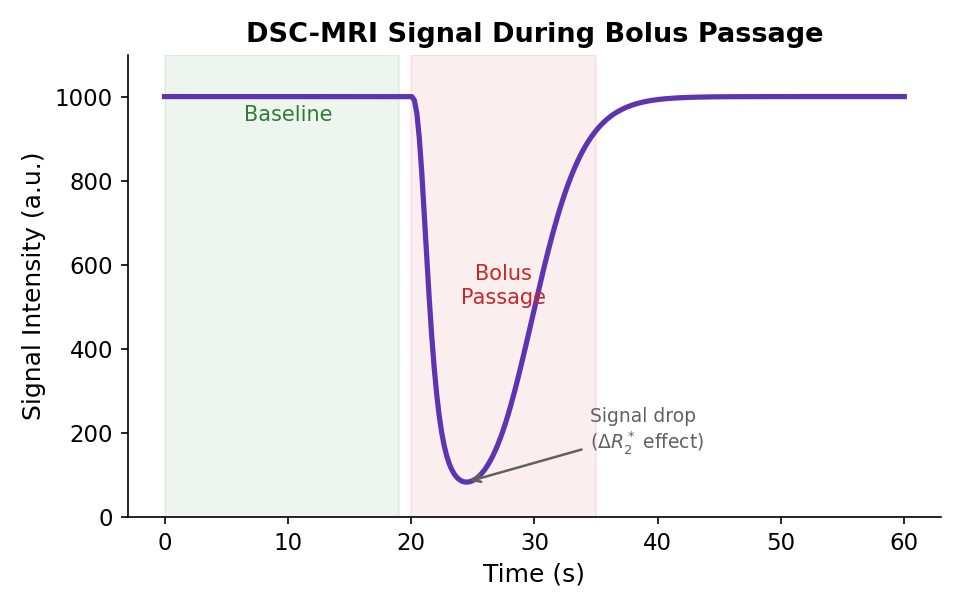
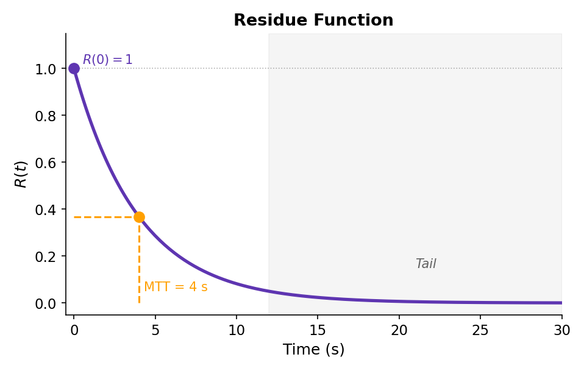
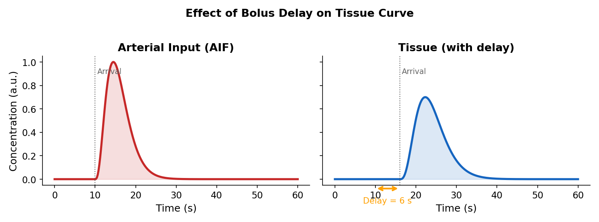

# Understanding DSC Deconvolution

DSC-MRI uses deconvolution to extract perfusion parameters from the measured signal.

## The Measurement

DSC-MRI tracks a gadolinium bolus through brain tissue using T2*-weighted imaging. The signal drops as contrast passes through:



## From Signal to Concentration

### T2* Signal Model

Gadolinium causes T2* shortening:

$$
S(t) = S_0 \cdot e^{-TE \cdot \Delta R_2^*(t)}
$$

Solving for ΔR2*:

$$
\Delta R_2^*(t) = -\frac{1}{TE} \ln\left(\frac{S(t)}{S_0}\right)
$$

### Concentration Relationship

ΔR2* is proportional to contrast concentration:

$$
\Delta R_2^*(t) = r_2^* \cdot C(t)
$$

Where r2* is the transverse relaxivity (osipy defaults: 32 s⁻¹mM⁻¹ for tissue, 50 s⁻¹mM⁻¹ for blood at 1.5T).

## The Indicator Dilution Problem

### Tissue Response

The tissue concentration C(t) is the convolution of the arterial input function (AIF) with a tissue response:

$$
C(t) = CBF \cdot \left[ C_{AIF}(t) \otimes R(t) \right]
$$

Where R(t) is the **residue function** (fraction of contrast remaining in tissue).

### What is the Residue Function?

R(t) describes how contrast leaves tissue:



- R(0) = 1: All contrast is present initially
- R(∞) = 0: Eventually all contrast leaves
- Shape depends on vasculature

## The Deconvolution Problem

### Forward Problem (Easy)

Given CBF, AIF, and R(t), calculate C(t):

$$
C(t) = CBF \cdot \int_0^t C_{AIF}(\tau) \cdot R(t-\tau) d\tau
$$

### Inverse Problem (Hard)

Given C(t) and AIF, find CBF and R(t):

$$
R(t) = \frac{1}{CBF} \cdot \text{deconvolution}[C(t), C_{AIF}(t)]
$$

This is **ill-posed**: small noise causes large errors.

## Matrix Formulation

### Discrete Convolution

In discrete form, convolution becomes matrix multiplication:

$$
\mathbf{C} = CBF \cdot \mathbf{A} \cdot \mathbf{R}
$$

Where:

$$
\mathbf{A} = \begin{pmatrix}
C_{AIF}(0) & 0 & 0 & \cdots \\
C_{AIF}(1) & C_{AIF}(0) & 0 & \cdots \\
C_{AIF}(2) & C_{AIF}(1) & C_{AIF}(0) & \cdots \\
\vdots & & & \ddots
\end{pmatrix} \cdot \Delta t
$$

### Solving the System

The deconvolution is:

$$
\mathbf{R} = \frac{1}{CBF} \cdot \mathbf{A}^{-1} \cdot \mathbf{C}
$$

But A⁻¹ amplifies noise → need regularization.

## SVD-Based Deconvolution

### Why SVD?

Singular Value Decomposition provides a stable way to invert A:

$$
\mathbf{A} = \mathbf{U} \cdot \mathbf{S} \cdot \mathbf{V}^T
$$

Where S is diagonal with singular values σ₁ > σ₂ > ... > σₙ.

### Truncation for Regularization

Small singular values amplify noise. Solution: truncate them.

$$
\mathbf{A}^{-1}_{truncated} = \mathbf{V} \cdot \mathbf{S}^{-1}_{truncated} \cdot \mathbf{U}^T
$$

Where σᵢ < threshold × σ₁ are set to zero.

## Deconvolution Methods

### sSVD (Standard SVD)

Direct SVD of the convolution matrix:

- **Pros**: Simple, widely used
- **Cons**: Sensitive to bolus delay
- **Threshold**: Typically 0.1-0.2

### cSVD (Circular SVD)

Uses block-circulant matrix (assumes periodic signal):

- **Pros**: Delay-insensitive
- **Cons**: May underestimate CBF
- **Note**: Commonly used in clinical software

### oSVD (Oscillation-Index SVD)

Selects threshold based on oscillation in R(t):

- **Pros**: Adaptive, noise-tolerant
- **Cons**: More complex
- **Criterion**: Minimize oscillations while preserving CBF

!!! example "oSVD oscillation index optimization"

    ```python
    # oSVD optimizes threshold to minimize oscillation index:
    OI = (1/R_max) * sum(|R(i+1) - R(i)|)
    # Choose threshold that balances low OI with accurate CBF
    ```

## Extracting Perfusion Parameters

### From the Residue Function

Once R(t) is estimated:

| Parameter | Calculation |
|-----------|-------------|
| CBF | max(R(t)) × scaling factor |
| CBV | Area under C(t) ÷ Area under AIF |
| MTT | CBV / CBF (central volume theorem) |
| Tmax | Time to maximum of R(t) |
| TTP | Time to minimum of S(t) |

### CBF Calculation

CBF = max[CBF × R(t)] = CBF × max[R(t)]

If R(t) is properly normalized (R(0)=1):

$$
CBF = max(\mathbf{R})
$$

### CBV Calculation

From conservation of tracer:

$$
CBV = \frac{\int_0^\infty C_{tissue}(t) dt}{\int_0^\infty C_{AIF}(t) dt} = \frac{AUC_{tissue}}{AUC_{AIF}}
$$

### MTT via Central Volume Theorem

The Central Volume Theorem relates:

$$
MTT = \frac{CBV}{CBF}
$$

This is a fundamental relationship in indicator dilution theory.

## Delay and Dispersion

### Bolus Delay

If tissue is fed by a delayed artery:

- Signal arrives later
- Standard deconvolution interprets this as low CBF
- Use cSVD or delay-corrected methods



### Bolus Dispersion

As blood flows through vessels, the bolus spreads:

- Peak concentration decreases
- Duration increases
- Affects CBF estimation

## Leakage Correction

### The Problem

In tumors with BBB breakdown, contrast leaks into tissue:

1. **T1 effect**: Leakage increases signal (opposite to T2* effect)
2. **T2* contamination**: Altered concentration curve

### Boxerman-Schmainda-Weisskoff (BSW) Correction

Models the leakage contribution:

$$
\Delta R_2^*(t) = K_1 \cdot \overline{\Delta R_2^*_{brain}}(t) + K_2 \cdot \int_0^t \overline{\Delta R_2^*_{brain}}(\tau) d\tau
$$

Where:

- K₁: Reflects residual T2* effects
- K₂: Reflects T1 leakage contamination

## Practical Considerations

### AIF Selection

Critical for accurate deconvolution:

- Should represent input to tissue
- Avoid partial volume with tissue
- Consider delay to imaging region

### Threshold Selection

For SVD truncation:

- **Too high**: Smooths R(t), underestimates CBF
- **Too low**: Noisy R(t), unreliable parameters

Typical range: 0.05-0.20 relative to σ₁

### Normalization

Results may need normalization:

- **rCBV**: CBV relative to white matter
- Accounts for intersubject AIF variability

## Clinical Applications

### Stroke

Perfusion maps help identify:

- **Infarct core**: Very low CBF, CBV
- **Penumbra**: Low CBF, maintained CBV
- **Tmax delay**: Indicator of collateral flow

### Tumors

DSC provides:

- **rCBV**: Correlates with tumor grade
- **Leakage**: Indicates BBB breakdown
- **Response assessment**: Changes with treatment

## References

1. Østergaard L et al. "High resolution measurement of cerebral blood flow using intravascular tracer bolus passages." *Magn Reson Med* 1996.

2. Wu O et al. "Tracer arrival timing-insensitive technique for estimating flow in MR perfusion-weighted imaging using singular value decomposition with a block-circulant deconvolution matrix." *Magn Reson Med* 2003.

3. Boxerman JL et al. "Relative cerebral blood volume maps corrected for contrast agent extravasation significantly correlate with glioma tumor grade." *AJNR* 2006.

## See Also

- [DSC-MRI Tutorial](../tutorials/dsc-analysis.md)
- [How to Use a Custom AIF](../how-to/use-custom-aif.md)
