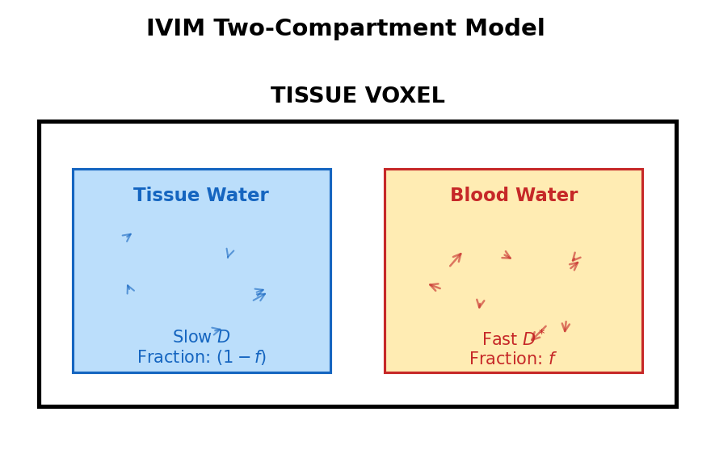
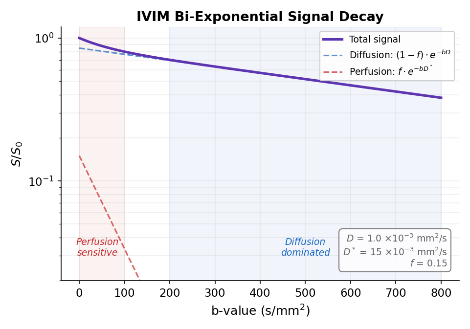

# Understanding IVIM Theory

Intravoxel Incoherent Motion (IVIM) imaging separates tissue diffusion from microvascular perfusion using diffusion-weighted MRI.

## The Core Concept

In a single imaging voxel, water molecules move in two different ways:

1. **True diffusion**: Random Brownian motion in tissue
2. **Pseudo-diffusion**: Motion in blood within capillaries

These create distinct signal decay patterns at different b-values.

## The Two-compartment model

### Tissue Compartment

Water molecules undergo **true diffusion**:

- Random thermal motion
- Constrained by cell membranes
- Relatively slow (D ≈ 1 × 10⁻³ mm²/s)

### Vascular Compartment

Blood water undergoes **pseudo-diffusion**:

- Flow through randomly oriented capillaries
- Appears like fast diffusion
- Much faster (D* ≈ 10-20 × 10⁻³ mm²/s)



## Signal Model

### Bi-Exponential Equation

The IVIM signal model is:

$$
\frac{S(b)}{S_0} = f \cdot e^{-b \cdot D^*} + (1-f) \cdot e^{-b \cdot D}
$$

Where:

| Parameter | Description | Typical Value |
|-----------|-------------|---------------|
| S(b) | Signal at b-value | measured |
| S₀ | Signal at b=0 | measured |
| f | Perfusion fraction | 0.05-0.30 |
| D* | Pseudo-diffusion coefficient | 5-100 × 10⁻³ mm²/s |
| D | Tissue diffusion coefficient | 0.5-2.0 × 10⁻³ mm²/s |

### Signal Behavior

At different b-values:



## Parameter Interpretation

### Diffusion Coefficient (D)

D reflects **true tissue diffusion**:

- Measures water mobility in tissue
- Influenced by cellularity, viscosity, membrane permeability
- Not affected by blood flow

**Clinical meaning**:

- Low D: High cellularity (tumors), restricted diffusion (stroke)
- High D: Low cellularity, necrosis, edema

### Pseudo-Diffusion Coefficient (D*)

D* reflects **microvascular blood flow**:

- Related to blood velocity and capillary geometry
- Much faster than tissue diffusion
- Large variability (10-100 × 10⁻³ mm²/s)

**Why it's "pseudo-diffusion"**:

- Blood flow in randomly oriented capillaries
- Appears as diffusion-like signal decay
- But mechanism is flow, not thermal motion

### Perfusion Fraction (f)

f represents the **vascular signal fraction**:

$$
f = \frac{V_{blood}}{V_{blood} + V_{tissue}} \cdot \frac{T_{2,blood}}{T_{2,tissue}}
$$

- Approximately equals blood volume fraction
- Weighted by T2 differences
- Typical values: 5-30% depending on tissue

## Mathematical Details

### Relationship to Conventional DWI

At high b-values (b > 200 s/mm²), perfusion contribution is negligible:

$$
\frac{S(b)}{S_0} \approx (1-f) \cdot e^{-b \cdot D}
$$

This is why:

- **ADC** (apparent diffusion coefficient) at high b ≈ D
- But ADC at low b is contaminated by perfusion

### Segmented Fitting

A practical fitting approach:

1. **Step 1**: Fit D from high b-values only

   Using b > 200 s/mm²:
   $$
   \ln(S/S_0) = -b \cdot D + \ln(1-f)
   $$

2. **Step 2**: Fix D, fit f and D* from low b-values

   Using all b-values with D fixed:
   $$
   S/S_0 = f \cdot e^{-b \cdot D^*} + (1-f) \cdot e^{-b \cdot D}
   $$

### Full Fitting

Simultaneously fit all three parameters:

- More accurate when SNR is high
- Requires good initial estimates
- May have convergence issues

## B-Value Selection

### Optimal Sampling

For reliable IVIM:

| B-value range | Purpose | Recommended values |
|---------------|---------|-------------------|
| 0 | Reference signal | 0 |
| 10-50 | Perfusion sensitivity | 10, 20, 30, 40, 50 |
| 100-200 | Transition region | 100, 150, 200 |
| 300-800 | Pure diffusion | 400, 600, 800 |

**Minimum**: 4 b-values (but limited reliability)
**Recommended**: 8-10 b-values

### Why Multiple Low B-Values?

The perfusion effect decays rapidly:

- At b = 50: ~60% of perfusion signal remains
- At b = 100: ~37% remains
- At b = 200: ~14% remains

More low b-values → better D* estimation

## Physical Constraints

### D* > D Constraint

Physically, D* must be greater than D:

- Blood flow is faster than tissue diffusion
- If D* < D, model assumptions are violated
- osipy enforces this constraint

### Parameter Bounds

Physiologically motivated bounds:

```python
D:   [0.1, 5.0] × 10⁻³ mm²/s
D*:  [2.0, 100.0] × 10⁻³ mm²/s
f:   [0.0, 0.7]
```

## Simplified Models

### Mono-Exponential (No IVIM)

Ignores perfusion:

$$
S(b)/S_0 = e^{-b \cdot ADC}
$$

- ADC = D when b is high
- ADC > D when low b-values included (perfusion contamination)

### Simplified IVIM

When D* >> D, can use:

$$
S(b)/S_0 \approx (1-f) \cdot e^{-b \cdot D} + f \cdot \delta(b=0)
$$

Where the perfusion term is essentially a step function.

## Applications

### Oncology

IVIM parameters can indicate:

- **Tumor cellularity** (low D = high cellularity)
- **Tumor vascularity** (high f = more vessels)
- **Treatment response** (changes in D, f)

### Liver

Particularly useful because:

- Dual blood supply (portal + arterial)
- High perfusion fraction
- Non-invasive assessment of fibrosis

### Brain

Challenging due to:

- Low f (small blood volume)
- White matter has very low perfusion
- But useful for stroke, tumors

## Limitations

### SNR Requirements

IVIM fitting is noise-sensitive:

- f and D* have high uncertainty
- D is less sensitive to noise (estimated from high b-values only)
- Requires multiple averages

### Motion Sensitivity

DWI is motion-sensitive:

- Breathing affects abdominal IVIM
- Cardiac pulsation affects brain
- Motion correction recommended

### Model Assumptions

The bi-exponential model assumes:

- Two distinct compartments
- No exchange between compartments
- Mono-exponential decay in each

These may be violated in:

- Pathological tissues
- Tissues with multiple compartments
- Very short or long b-value ranges

## Relationship to Other Techniques

### IVIM vs ASL

Both measure perfusion without contrast:

| Aspect | IVIM | ASL |
|--------|------|-----|
| Measures | f, D* | CBF directly |
| Units | fraction, mm²/s | ml/100g/min |
| Technique | Diffusion-weighted | Spin labeling |
| Best for | Liver, tumors | Brain |

### IVIM vs DCE

| Aspect | IVIM | DCE |
|--------|------|-----|
| Contrast | None | Gadolinium |
| Parameters | D, D*, f | Ktrans, ve, vp |
| Perfusion info | Indirect (f) | Direct |
| Safety | No contrast risk | Contrast concerns |

## References

1. Le Bihan D et al. "Separation of diffusion and perfusion in intravoxel incoherent motion MR imaging." *Radiology* 1988.

2. Koh DM et al. "Intravoxel incoherent motion in body diffusion-weighted MRI: Reality and challenges." *AJR* 2011.

3. Federau C. "Intravoxel incoherent motion MRI as a means to measure in vivo perfusion: A review of the evidence." *NMR Biomed* 2017;30(11):e3780.

## See Also

- [IVIM Tutorial](../tutorials/ivim-analysis.md)
- [How to Handle Fitting Failures](../how-to/handle-fitting-failures.md)
