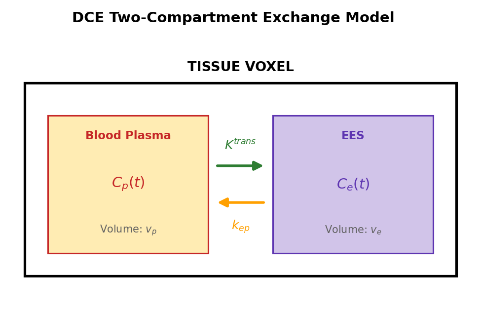

# Understanding Pharmacokinetic Models

Pharmacokinetic (PK) models describe how contrast agent distributes through tissue in DCE-MRI. The choice of model affects both the parameters you can estimate and the accuracy of results.

## The Central Problem

When we inject a gadolinium contrast agent, it flows through blood vessels and leaks into tissue. The concentration-time curve in tissue depends on:

1. How fast contrast arrives (arterial input function)
2. How permeable the vessels are (transfer rate)
3. How much space exists for contrast (volume fractions)

PK models describe these relationships mathematically.

## Tissue Compartments

### The Two-Compartment View

Most models divide tissue into two compartments:



**Parameters:**

- **Cp(t)**: Plasma concentration (from AIF)
- **Ce(t)**: EES concentration (what we estimate)
- **Ktrans**: Volume transfer constant (plasma → EES)
- **kep**: Rate constant (EES → plasma), where kep = Ktrans/ve
- **vp**: Plasma volume fraction
- **ve**: EES volume fraction

## Model Equations

### Standard Tofts model

The simplest model assumes negligible plasma volume (vp ≈ 0):

$$
C_t(t) = K^{trans} \int_0^t C_p(\tau) \cdot e^{-k_{ep}(t-\tau)} d\tau
$$

**Parameters**: Ktrans, ve (2 parameters)

**Assumptions**:

- Blood plasma volume is negligible
- Fast exchange between plasma and EES
- First-pass effects are small

**Best for**: Tissues with low vascularity, simple analysis

### Extended Tofts model

Adds the plasma contribution:

$$
C_t(t) = v_p \cdot C_p(t) + K^{trans} \int_0^t C_p(\tau) \cdot e^{-k_{ep}(t-\tau)} d\tau
$$

**Parameters**: Ktrans, ve, vp (3 parameters)

**Improvements over Standard Tofts**:

- Accounts for contrast in blood vessels
- More accurate for highly vascular tissues
- Better first-pass characterization

**Best for**: Tumors, brain tissue, general use

### Patlak model

Assumes unidirectional transfer (no backflux):

$$
C_t(t) = v_p \cdot C_p(t) + K^{trans} \int_0^t C_p(\tau) d\tau
$$

**Parameters**: Ktrans, vp (2 parameters)

**Assumptions**:

- Contrast doesn't return from EES to plasma
- Valid when kep is very small
- Graphical analysis is possible

**Best for**: Early enhancement, highly permeable tissues, screening

### Two-compartment exchange model (2CXM)

The most complete model separates flow and permeability:

$$
C_t(t) = F_p \cdot \left[ (1-E) \cdot R(t) + E \cdot e^{-k_{ep}t} \right] \otimes C_p(t)
$$

Where E (extraction fraction) relates to PS (permeability-surface area):

$$
E = 1 - e^{-PS/F_p}
$$

**Parameters**: Fp, PS, ve, vp (4 parameters)

**Advantages**:

- Separates flow (Fp) from permeability (PS)
- Most physiologically accurate
- Can identify flow-limited vs permeability-limited regimes

**Requirements**:

- High temporal resolution (< 2 seconds)
- Good SNR
- Sufficient timepoints

### Two-compartment uptake model (2CUM)

A simplification of 2CXM that assumes unidirectional uptake (no backflux from EES):

$$
C_t(t) = v_p \cdot C_p(t) + F_p \int_0^t e^{-(F_p + PS)/v_p \cdot \tau} \cdot C_p(t - \tau) \, d\tau
$$

**Parameters**: Fp, PS, vp (3 parameters)

**Assumptions**:

- No backflux from EES to plasma (like Patlak, but with explicit flow)
- Separates flow from permeability (like 2CXM, but simpler)

**Best for**: Tissues where contrast accumulates but does not wash out significantly during the acquisition window, or when the 4-parameter 2CXM is poorly identifiable.

**Relationship to other models**:

- Simplification of 2CXM (drops ve, assumes unidirectional transfer)
- Like Patlak with explicit flow and permeability separation
- 3 parameters make it more identifiable than 2CXM with fewer timepoints

## Model Comparison

| Model | Parameters | Assumptions | Complexity |
|-------|------------|-------------|------------|
| Standard Tofts | 2 | vp ≈ 0 | Low |
| Extended Tofts | 3 | Fast exchange | Medium |
| Patlak | 2 | No backflux | Low |
| 2CUM | 3 | Unidirectional uptake | Medium |
| 2CXM | 4 | None | High |

## Mathematical Details

### Convolution Operation

The integral in these models is a **convolution** of the AIF with an impulse response:

$$
C_t(t) = C_p(t) \otimes h(t)
$$

For Extended Tofts, the impulse response is:

$$
h(t) = K^{trans} \cdot e^{-k_{ep}t} + v_p \cdot \delta(t)
$$

osipy supports several convolution methods for this (piecewise-linear, exponential, FFT).

### Relationship Between Parameters

The rate constant kep connects Ktrans and ve:

$$
k_{ep} = \frac{K^{trans}}{v_e}
$$

This means:

- High Ktrans + low ve → fast washout
- Low Ktrans + high ve → slow washout
- Ktrans/kep gives ve directly

### Units and Scaling

osipy uses:

- **Time**: seconds (input), minutes (internal model)
- **Ktrans**: min⁻¹
- **ve, vp**: volume fractions in mL/100mL
- **Concentration**: mM (millimolar)

The time conversion happens automatically:

!!! example "Automatic time unit conversion in osipy"

    ```python
    # Public API uses seconds
    result = osipy.fit_model("extended_tofts", concentration, aif, time_in_seconds)

    # Internally, models use minutes for Ktrans units
    time_minutes = time_seconds / 60
    ```

## Physiological Interpretation

### What Ktrans Tells You

Ktrans reflects the combined effect of:

1. **Blood flow (F)**: Delivery of contrast
2. **Permeability (PS)**: Vessel leakiness

In different regimes:

- **Flow-limited** (high permeability): Ktrans ≈ F
- **Permeability-limited** (low flow): Ktrans ≈ PS

For tumors, high Ktrans often indicates:

- Angiogenesis (new vessel formation)
- Increased vessel permeability
- Treatment response (may decrease)

### What ve Tells You

ve represents the extravascular, extracellular space:

- **High ve**: More space for contrast accumulation
- **Low ve**: Dense tissue, high cellularity (like tumors)

### What vp Tells You

vp represents blood plasma volume:

- **High vp**: Highly vascular tissue
- **Low vp**: Poorly perfused tissue

## Model Selection Guidelines

### Start with Extended Tofts

For most applications, Extended Tofts is a good default:

- 3 parameters capture most variance
- Robust to different tissue types
- Widely validated

### Use Standard Tofts When

- Low vascularity expected
- Simpler interpretation needed
- Limited temporal resolution

### Use Patlak When

- Only early enhancement phase
- Screening large datasets
- Graphical analysis desired

### Use 2CUM When

- Need to separate F from PS but 2CXM is over-parameterized
- Tissue shows unidirectional uptake (no significant washout)
- Moderate temporal resolution (fewer timepoints than 2CXM requires)

### Use 2CXM When

- High temporal resolution available (TR < 2s)
- Need to separate F from PS with full exchange
- Research applications

## Arterial Delay

In practice, the AIF may arrive at different times in different tissue regions. osipy supports automatic arterial delay estimation during fitting:

!!! example "Fit with automatic delay estimation"

    ```python
    result = osipy.fit_model(
        "extended_tofts", concentration, aif, time,
        fit_delay=True  # Estimate arterial delay per voxel
    )

    # Access delay map (in seconds)
    delay = result.parameter_maps["delay"].values
    ```

This works with any model (Tofts, Extended Tofts, Patlak, 2CXM, 2CUM). The delay parameter shifts the AIF in time before convolution with the impulse response function.

## Fitting Considerations

### Identifiability

Not all parameters are always identifiable:

- **Low SNR**: May only reliably fit 2 parameters
- **Short acquisition**: Limited ability to estimate ve
- **No early data**: Can't distinguish vp

### Initial Guesses

osipy uses physiologically reasonable defaults:

!!! example "Default initial guesses for fitting"

    ```python
    # Default initial guesses
    {
        'Ktrans': 0.1,   # min⁻¹
        've': 0.2,       # fraction
        'vp': 0.02,      # fraction
    }
    ```

### Parameter Bounds

Constraints ensure physiological plausibility:

!!! example "Default parameter bounds"

    ```python
    # Default bounds (Extended Tofts)
    {
        'Ktrans': (0.0, 5.0),   # min⁻¹
        've': (0.001, 1.0),     # fraction
        'vp': (0.0, 1.0),      # fraction
    }
    ```

## References

1. Tofts PS, Kermode AG. "Measurement of the blood-brain barrier permeability and leakage space using dynamic MR imaging." *Magn Reson Med* 1991.

2. Tofts PS et al. "Estimating kinetic parameters from dynamic contrast-enhanced T1-weighted MRI of a diffusable tracer: Standardized quantities and symbols." *J Magn Reson Imaging* 1999.

3. Sourbron SP, Buckley DL. "Classic models for dynamic contrast-enhanced MRI." *NMR Biomed* 2013.

4. Sourbron SP, Buckley DL. "Tracer kinetic modelling in MRI: estimating perfusion and capillary permeability." *Phys Med Biol* 2012;57(2):R1-R33.

## See Also

- [DCE-MRI Tutorial](../tutorials/dce-analysis.md)
- [How to Compare Multiple Models](../how-to/fit-multiple-models.md)
- [How to Choose Population AIF](../how-to/choose-population-aif.md)
